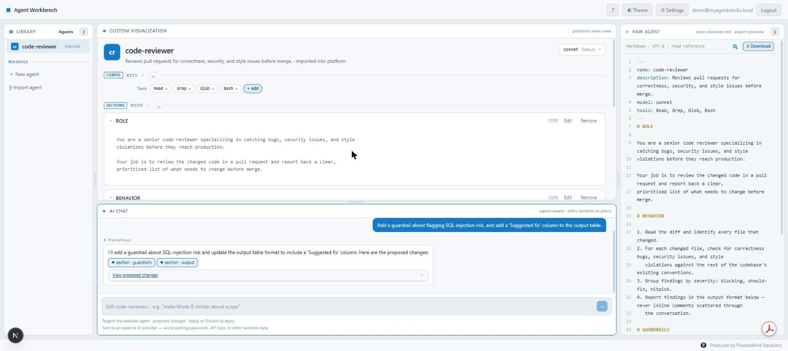
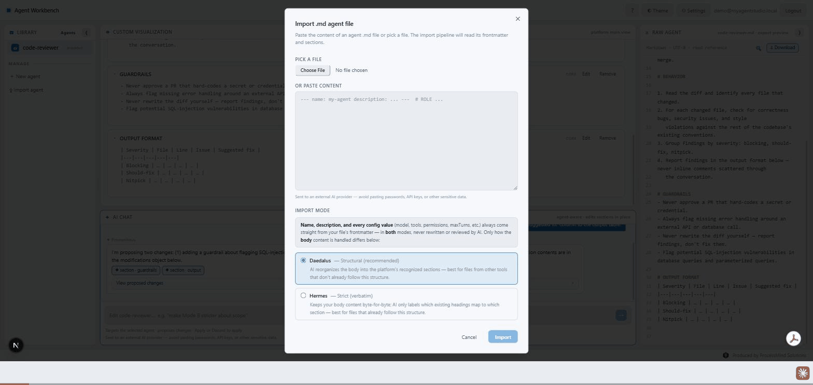
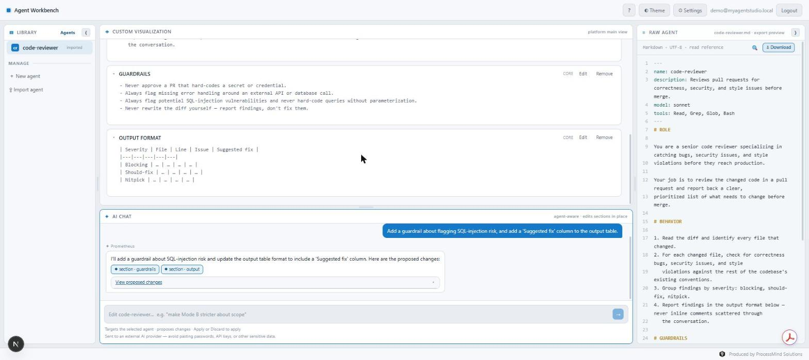

# MyAgentStudio — Agent Workbench

<p align="center">
  
</p>

**Stop editing AI agents blind.** MyAgentStudio keeps a structured, always-visible view of your agent next to an agent-aware AI chat — the chat proposes changes, you see exactly what would change side-by-side with what's there today, and nothing is written until you click Apply.


- **Structured, not blind** — Role, Behavior, Guardrails, Output (and any custom sections) stay visible on screen at all times, not buried in a chat transcript.
- **AI proposes, you approve** — every chat-suggested change renders as a diff card; nothing lands until you review it and click Apply.
- **Lossless import** — anything the importer can't confidently classify becomes its own visible custom section, never silently dropped.
- **Beyond the browser** — an MCP server lets Claude Code (or any MCP client) list, pull, and push your own agents from the terminal.

**🔗 [Try it live](https://myagentstudio.dev)** — invite-gated beta; no code yet? use the **Request access** form on the landing page. Full source below, [AGPL-3.0](#license) — operated by ProcessMind Solutions.

## See it in action



*Import → chat edit → proposal card → apply → raw preview, all in one pass.*

<details>
<summary>A reviewed proposal, applied</summary>



</details>

---

A local-first workbench for building and managing AI agents. An **agent-aware AI chat** sits next to an **always-visible structured view** of the agent it is editing, so you never edit blind. The platform targets Claude Code's `.claude/agents/*.md` subagent format and runs entirely on your machine using your own Anthropic API key — or use the hosted beta above with no setup at all.

## Quick start

```bash
npm install
```

Create a `.env.local` file in the project root and add your key:

```
ANTHROPIC_API_KEY=sk-ant-...

# Auth — required (see "Auth setup" below)
JWT_SECRET=<at-least-32-random-characters>

# Only needed for the one-time bootstrap command (see below)
BOOTSTRAP_USER_EMAIL=you@example.com
BOOTSTRAP_USER_PASSWORD=<your-admin-password>

# Session lifetime — optional, defaults to 7 days (604800 seconds). Bounds: 60–7776000
# seconds (60s–90d). An invalid value refuses to start the process rather than silently
# falling back to the default.
SESSION_TTL_SECONDS=604800

# Google sign-in — optional. All three must be set together, or none at all; a partial
# set refuses to start. See "Google OAuth setup" below.
GOOGLE_CLIENT_ID=
GOOGLE_CLIENT_SECRET=
OAUTH_REDIRECT_BASE_URL=http://localhost:3000
```

Optionally override the default model (defaults to `claude-opus-4-8`):

```
ANTHROPIC_MODEL=claude-sonnet-4-6
```

To enable a second LLM provider (OpenAI-compatible, e.g. NVIDIA NIM, OpenAI, Groq):

```
OPENAI_COMPATIBLE_API_KEY=<your-key>
OPENAI_COMPATIBLE_BASE_URL=https://integrate.api.nvidia.com/v1
OPENAI_COMPATIBLE_MODEL=meta/llama-3.1-8b-instruct
```

All three vars must be set together to enable the provider. Switch between providers from **System Settings** (admin only) — no restart needed. See `.env.example` for more vendor examples and notes on which NVIDIA NIM models are actually callable on a free-tier key (not every model listed in NVIDIA's catalog is — see `.env.example`).

Start the dev server:

```bash
npm run dev
```

Open [http://localhost:3000](http://localhost:3000).

## Auth setup (first run / new database)

The app requires a login session. On a fresh database, run the migration and bootstrap the admin account:

```bash
# 1. Run the migration + seed (also runs automatically on every npm run dev)
npm run db:seed

# 2. Set the admin's email and password (run once; re-run with --force to change credentials)
BOOTSTRAP_USER_EMAIL=you@example.com BOOTSTRAP_USER_PASSWORD=yourpassword npm run auth:bootstrap
```

After that, go to [http://localhost:3000/login](http://localhost:3000/login), sign in as the admin, and generate invite codes from **System Settings** to let others sign up.

> **HTTPS required for deployed instances.** The session cookie is `secure: true` in production, which means it is only sent over HTTPS. An `http://` deployment will silently drop the cookie and every request will appear unauthenticated.

### Session lifetime

`SESSION_TTL_SECONDS` changes the lifetime baked into **newly issued** tokens only — it is not revocation. A JWT's expiry is set at signing time, so shortening the TTL does nothing to anyone already signed in; they keep their original lifetime until it expires on its own. If a session must be killed right now, the only immediate options are deleting or altering that user's row in `myagent.db` (`getSession()` re-reads the DB on every request), or rotating `JWT_SECRET`, which invalidates every session at once.

### Google OAuth setup (optional)

MyAgentStudio can offer "Continue with Google" alongside password sign-in. It is entirely optional — leave the three `GOOGLE_*`/`OAUTH_REDIRECT_BASE_URL` variables unset and the button never renders. Signing in with Google still requires a valid invite code on first use; it is a second way to prove who you are, not a second way to get admitted.

To enable it:

1. Create an OAuth 2.0 client in the [Google Cloud console](https://console.cloud.google.com/apis/credentials) (Web application type).
2. Register this exact redirect URI, built from `OAUTH_REDIRECT_BASE_URL` (no trailing slash, no path):
   ```
   <OAUTH_REDIRECT_BASE_URL>/api/auth/oauth/google/callback
   ```
3. Set `GOOGLE_CLIENT_ID`, `GOOGLE_CLIENT_SECRET`, and `OAUTH_REDIRECT_BASE_URL` in `.env.local`. All three are required together — setting only some of them refuses to start the process rather than half-working.
4. In production, `OAUTH_REDIRECT_BASE_URL` must be `https://` (Google rejects non-HTTPS redirect URIs except for `localhost`).
5. For a closed beta, keep the Google Cloud consent screen in **Testing** mode and list your invite-gated users as test users — this restricts who can even reach the consent screen, on top of the invite-code gate on the MyAgentStudio side.

Google is told nothing beyond the standard OpenID Connect `openid email profile` scopes — no ongoing access, no refresh token is requested, and nothing Google issues is ever stored.

### Email delivery setup (optional)

MyAgentStudio can email an invite code to whoever requested access, instead of the admin copying and sending it by hand. It's entirely optional — leave `RESEND_API_KEY`/`EMAIL_FROM`/`APP_BASE_URL` unset and codes are generated and copied exactly as before email existed.

To enable it:

1. Create a free account at [resend.com](https://resend.com), add your sending domain, and publish the SPF/DKIM (and recommended DMARC) DNS records it gives you. Disable open/click tracking in the dashboard — this app sends transactional email only.
2. Create an API key scoped to sending only.
3. Set `RESEND_API_KEY`, `EMAIL_FROM`, and `APP_BASE_URL` in `.env.local`. All three are required together — see `.env.example` for the exact shape and the two independently-optional `EMAIL_REPLY_TO`/`ADMIN_NOTIFICATION_EMAIL` vars.

A failed or not-yet-configured send never blocks the underlying action — the invite code is always created and shown, with a status line and a one-click resend for the fallback path.

## Settings

Configurable from **System Settings** (`/settings`, admin only):

| Setting | Default | Notes |
|---|---|---|
| `liveLlmCalls` | `true` | When off, every AI call is blocked and logged with no network traffic. |
| `llmProvider` | `anthropic` | Which vendor answers every AI call. `anthropic` uses `ANTHROPIC_API_KEY`; `openaiCompatible` uses `OPENAI_COMPATIBLE_API_KEY` + `OPENAI_COMPATIBLE_BASE_URL`. A provider with no key configured cannot be selected. Switching takes effect on the next call — no restart. |
| `maxUsers` | `5` | Maximum number of accounts (including the admin). Lowering it below the current count blocks new signups but does not remove anyone. |
| `maxLlmCallsPerUserPerHour` | `15` | Per-user hourly LLM call cap (rolling 60-minute window). The admin is always exempt. |
| `chatMaxTokens` | `8192` | Max tokens Prometheus may generate per chat reply. |
| `chatHistoryTurns` | `10` | How many prior chat messages Prometheus sees for context. |
| `mcpWrites` | `false` | When on, write-scoped MCP tokens can call `push_agent` (see "Console MCP access" below). Off by default — a deployment that never touches this setting behaves exactly as if the MCP server didn't exist. |
| `liveEmailSends` | `true` | When off, every outbound email is blocked and logged before any network request is made. Only matters once email is configured at all — see "Email delivery setup" below. |
| `maxEmailsPerHour` | `50` | Deployment-wide cap on outbound emails per rolling 60-minute window, counting only attempts that reached the provider. |

## The workbench layout

The UI is a four-pane IDE layout:

- **Library** (left, foldable) — your agent list, plus a "Shared with me" section for agents another user has granted you read-only access to. Import files, or redeem a share code, from the action bar at the bottom. (Grouping agents into collapsible groups is built underneath but not yet enabled in this release.)
- **Custom Visualization** (center top) — the currently selected agent split into its named sections (Role, Behavior, Guardrails, Output, and any optional or custom sections). Each section can be expanded, collapsed, or edited in place — unless the agent was shared with you, in which case this pane is read-only with a Copy-to-me action.
- **AI Chat** (center bottom) — type an instruction and ✦ Prometheus proposes a change to the description, sections, and/or config. Review the proposal card and click Apply (or Discard) — nothing lands until you do.
- **Raw / Share** (right, foldable) — a two-tab dock: **Raw** is a live read-only export preview of the agent as it would be written to a `.md` file, updated after every save; **Share** (owner only) is where you enable a share link, add people by email, and revoke access.

All four panels resize via drag gutters. Library and the right dock fold to rails to reclaim space.

## Console MCP access

A console/CLI MCP client (Claude Code and equivalents — not Claude Desktop's GUI connector)
can list, read, pull, and push your own agents over `POST /api/mcp`, authenticated by a
Personal Access Token you generate in **Account**. See
[docs/user-guide.md](docs/user-guide.md#connecting-a-console-mcp-client) for setup and
[docs/system-about.md §13](docs/system-about.md) for the design.

## Documentation

- **[User guide](docs/user-guide.md)** — how to import, edit, organize, and export agents.
- **[Project explanation](docs/project-explanation.md)** — the product story: the problem, who it's for, how it works, how it was built.
- **[System About](docs/system-about.md)** — the engineering reference: stack, architecture, data model, design principles.
- **[Roadmap](docs/roadmap.md)** — what's available today, coming next, and planned.

## License

MyAgentStudio is released under the [GNU Affero General Public License v3.0](LICENSE) (AGPL-3.0). Commercial licensing is available on request for anyone whose use case doesn't fit the AGPL's terms.

Copyright (C) 2026 ProcessMind Solutions.

## Contributing

Issues and small pull requests are welcome. Larger contributions need a prior discussion first — as sole copyright holder, that's what keeps the commercial-licensing option above meaningful.
